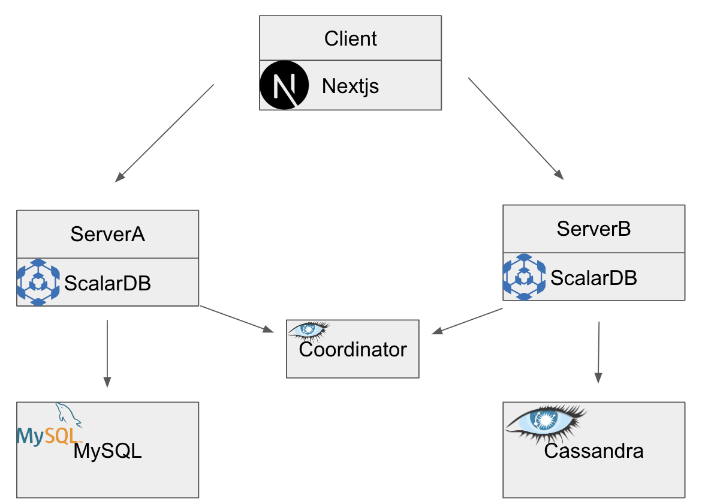
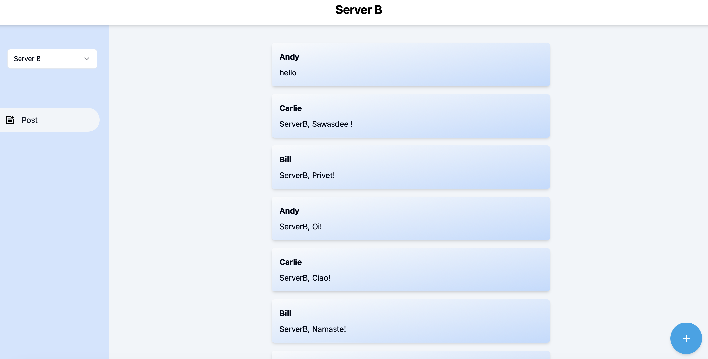
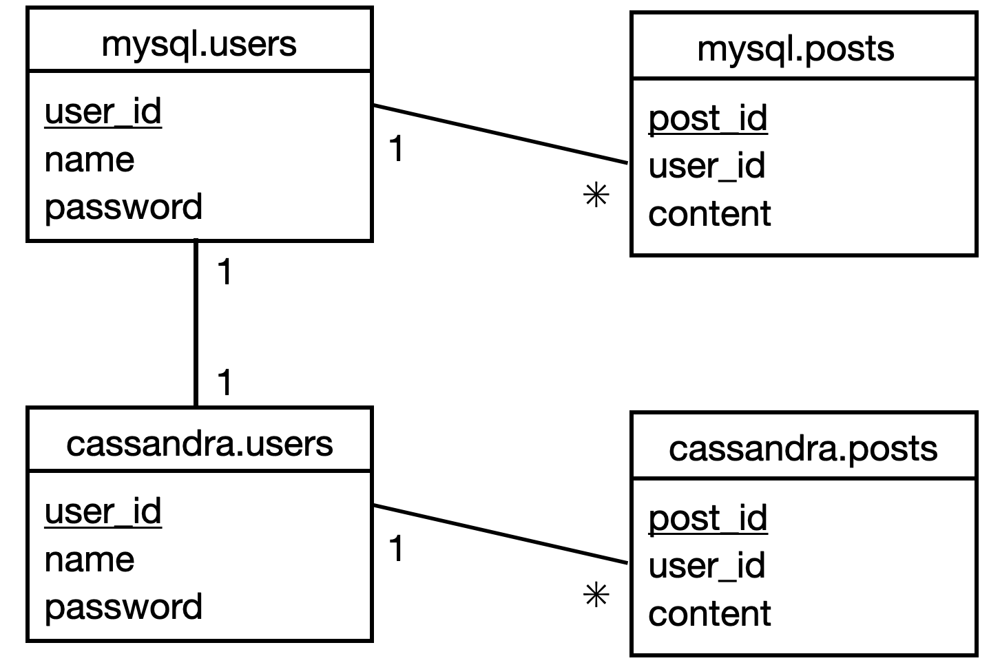

# Sample application of distributed Social Network Service with scalarDB

This repository is a distributed SNS sample application using scalarDB.

## Overview

The application architecture is as follows:

- Client: User interface using Next.js
- Server A : Accesses MySQL database through ScalarDB
- Server B: Accesses Cassandra database through ScalarDB
- Coordinator: Manages communication between the ServerA and ServerB



For more detailed information, please refer to [this slide](https://docs.google.com/presentation/d/1TTx-xpSkOx1mSo1llOV1hijUctNk4g-UKc0dB9yXDBc/edit?usp=sharing)


## Prerequisites

- One of the following Java Development Kits (JDKs):
  - [Oracle JDK](https://www.oracle.com/java/technologies/downloads/) LTS version (8, 11, or 17)
  - [OpenJDK](https://openjdk.org/install/) LTS version (8, 11, or 17)
- [Docker](https://www.docker.com/get-started/) 20.10 or later with [Docker Compose](https://docs.docker.com/compose/install/) V2 or later


**Note**

We recommend using the LTS versions mentioned above, but other non-LTS versions may work.

In addition, other JDKs should work with ScalarDB, but we haven't tested them.


<div class="notice--info">{{ notice--info | markdownify }}</div>

## Set up ScalarDB

The following sections describe how to set up the sample application that supports microservices transactions in ScalarDB.

### Clone the ScalarDB samples repository

Open **Terminal**, then clone the ScalarDB samples repository by running the following command:

```console
git clone https://github.com/scalar-labs/scalardb-samples
```

Then, go to the directory that contains the sample application by running the following command:

```console
cd scalardb-samples/microservice-transaction-sample
```

### Start Cassandra and MySQL

Cassandra and MySQL are already configured for the sample application, as shown in [`database.properties`](database.properties). For details about configuring the multi-storage transactions feature in ScalarDB, see [How to configure ScalarDB to support multi-storage transactions](https://github.com/scalar-labs/scalardb/blob/master/docs/multi-storage-transactions.md#how-to-configure-scalardb-to-support-multi-storage-transactions).

To start Cassandra and MySQL, which are included in the Docker container for the sample application, run the following command:

```console
docker-compose up -d mysql cassandra
```


**Note**

Starting the Docker container may take more than one minute depending on your development environment.


<div class="notice--info">{{ notice--info | markdownify }}</div>

### Load the schema

The database schema (the method in which the data will be organized) for the sample application has already been defined in [`mysql-schema.json`](mysql-schema.json) for the MySQL server and [`casasndra-schema.json`](cassandra-schema.json) for the Cassandra server.

To apply the schema, go to the [ScalarDB Releases](https://github.com/scalar-labs/scalardb/releases) page and download the ScalarDB Schema Loader that matches the version of ScalarDB that you want to use to the `scalardb-samples/microservice-transaction-sample` folder.

#### MySQL

To load the schema for [`mysql-schema.json`](mysql-schema.json) into MySQL, run the following command

```console
java -jar scalardb-schema-loader-3.12.2.jar --config database-mysql.properties --schema-file mysql-schema.json

```

*This command sometimes fails, so when fails, please execute command again*

#### Cassandra

To load the schema for [`cassandra-schema.json`](cassandra-schema.json) into Cassandra, run the following command

```console
java -jar scalardb-schema-loader-3.12.2.jar --config database-cassandra.properties --schema-file cassandra-schema.json --coordinator
```

### Load the initial data by starting the microservices

Before starting the microservices, build the Docker images of the sample application by running the following command:

```console
./gradlew docker
```

Then, start the microservices by running the following command:

```console
docker-compose up -d mysql-server cassandra-server
```

## Start Application
Please move to web directory and install packages.
```console
cd web
npm i
```

After finish installing packages, execute following command.
```console
npm run dev
```

If successfully started, open `localhost:3000` on your browser.

If all the operations up to this point have been successful, you should be able to see the following screen: 



You can see and put posts.


#### Schema details

As shown in [`mysql-schema.json`](mysql-schema.json) for the sample application, all the tables for the MySQL server are created in the `mysql` namespace.

- `mysql.users`: a table that manages users' information
  - `user_id`: primary key
  - `name`
  - `password`

- `mysql.posts`: a table that manages posts' information
  - `post_id`: primary key
  - `user_id`: foreign key
  - `content`

As shown in [`cassandra-schema.json`](cassandra-schema.json) for the sample application, all the tables for the Cassandra server are created in the `cassandra` namespace.

- `cassandra.users`: a table that manages users' information
  - `user_id`: primary key
  - `name`
  - `password`

- `cassandra.posts`: a table that manages posts' information
  - `post_id`: primary key
  - `user_id`: foreign key
  - `content`

The Entity Relationship Diagram for the schema is as follows:



#### MySQL server

After starting the microservices and the initial data has loaded, the following records should be stored in the `mysql.users` table:

| user_id | name   | password      |
|---------|--------|---------------|
| 1       | Andy   | passwordandy  |
| 2       | Bill   | passwordbill  |
| 3       | Carlie | passwordcarlie|

And the following records should be stored in the `mysql.posts` table:

| post_id | user_id |    content     |
|---------|---------|----------------|
| 1       | 1       | MySQL,Aloha!   |
| 2       | 2       | MySQL,Bonjour! |
| 3       | 3       | MySQL,Ciao!    |


#### Cassandra server

After starting the microservices and the initial data has loaded, the following records should be stored in the `cassandra.users` table:

| user_id | name   | password      |
|---------|--------|---------------|
| 1       | Andy   | passwordandy  |
| 2       | Bill   | passwordbill  |
| 3       | Carlie | passwordcarlie|

And the following records should be stored in the `cassandra.posts` table:

| post_id | user_id |      content       |
|---------|---------|--------------------|
| 1       | 1       | Casasndra,Aloha!   |
| 2       | 2       | Cassandra,Bonjour! |
| 3       | 3       | Casasndra,Ciao!    |


## Execute transactions and retrieve data in the sample application

The following sections describe how to execute transactions and retrieve data in the sample distributed SNS application.

### Create user information for register

Create user information on MySQL and Cassandra by running the following command:

```console
./gradlew :client:run --args="CreateUser Kida password"
```

*This command needs distributed transaction*

### Get user information for login

Start with getting information about the user whose ID is `4` from MySQL by running the following command:

```console
./gradlew :client:run --args="GetUserFromMysql 4"
```

You should see the following output:

```console
...
{"id": 4,"name": "Kida","password": "password"}
...
```

### Get all users

Get all users from MySQL by running the following command:
```console
./gradlew :client:run --args="GetAllUsersFromMysql"
```

You should see the following output:

```console
...
{"users": [{"user_id": 1,"name": "Andy","password": "passwordandy"},{"user_id": 2,"name": "Bill","password": "passwordbill"},{"user_id": 3,"name": "Carlie","password": "passwordcarlie"},{"user_id": 4,"name": "Kida","password": "password"}]}
...
```

Get all users from Cassandra by running the following command:
```console
./gradlew :client:run --args="GetAllUsersFromCassandra"
```

You should see the following output:

```console
...
{"users": [{"user_id": 1,"name": "Andy","password": "passwordandy"},{"user_id": 2,"name": "Bill","password": "passwordbill"},{"user_id": 3,"name": "Carlie","password": "passwordcarlie"},{"user_id": 4,"name": "Kida","password": "password"}]}
...
```

You will see the same output from MySQL and Cassandra.

### Create post

Create Post by running the following command:

```console
./gradlew :client:run --args="CreatePostOnMysql 4 MySQL,Konnichiwa! "
```

```console
./gradlew :client:run --args="CreatePostOnCassandra 4 Cassandra,Konnichiwa! "
```

### Get Post

Get post from MySQL by running the following command:

```console
./gradlew :client:run --args="GetPostFromMysql 4"
```
You should see the following output:

```console
...
{"post_id": 4,"user_id": 4,"content": "MySQL,Konnichiwa!"}
...
```

Get post from Cassandra by running the following command:

```console
./gradlew :client:run --args="GetPostFromCassandra 4"
```
You should see the following output:

```console
...
{"post_id": 4,"user_id": 4,"name": "Kida","content": "Cassandra,Konnichiwa!"}
...
```

### Get all posts

Get all posts from MySQL by running the following command:
```console
./gradlew :client:run --args="GetAllPostsFromMysql"
```
You should see the following output:

```console
...
{"posts": [{"post_id": 1,"user_id": 1,"name": "Andy","content": "MySQL,Aloha!"},{"post_id": 2,"user_id": 2,"name": "Bill","content": "MySQL,Bonjour!"},{"post_id": 3,"user_id": 3,"name": "Carlie","content": "MySQL,Ciao!"},{"post_id": 4,"user_id": 4,"name": "Kida","content": "MySQL,Konnichiwa!"}]}
...
```

Get all posts from Cassandra by running the following command:
```console
./gradlew :client:run --args="GetAllPostsFromCassandra"
```
You should see the following output:

```console
...
{"posts": [{"post_id": 1,"user_id": 1,"name": "Andy","content": "Cassandra,Aloha!"},{"post_id": 2,"user_id": 2,"name": "Bill","content": "Cassandra,Bonjour!"},{"post_id": 3,"user_id": 3,"name": "Carlie","content": "Casasndra,Ciao!"},{"post_id": 4,"user_id": 4,"name": "Kida","content": "Cassandra,Konnichiwa!"}]}
...
```

## Stop the sample application

To stop the sample application, you need to stop the Docker containers that are running Cassandra, MySQL, and the microservices. To stop the Docker containers, run the following command:

```console
docker-compose down
```
