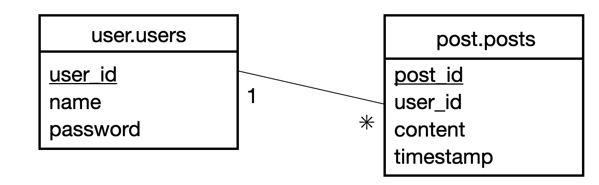

> [!CAUTION]
> 
> This doc has been moved to the centralized ScalarDB documentation repository, [docs-internal-scalardb](https://github.com/scalar-labs/docs-internal-scalardb). Please update this documentation in that repository instead.
> 
> To view the ScalarDB documentation, visit [ScalarDB Documentation](https://scalardb.scalar-labs.com/docs/).

# Create a Sample Application That Supports Multi-Storage Transactions

This tutorial describes how to create a sample application that supports the multi-storage transactions feature in ScalarDB.

## メモ

schema.jsonでスキーマが定義されている。この内容を変更して、分散SNS用のデータベースを作成する。
コマンドに関しては、src/main/java/sample以下のSample.javaにて実装が、/command以下のファイルにてインターフェースが記載されている。

## Overview

The sample e-commerce application shows how users can order and pay for items by using a line of credit. The use case described in this tutorial is the same as the basic [ScalarDB sample](../scalardb-sample/README.md) but takes advantage of the [multi-storage transactions](https://github.com/scalar-labs/scalardb/blob/master/docs/multi-storage-transactions.md) feature in ScalarDB.

In this tutorial, you will build an application that uses both Cassandra and MySQL. By using the multi-storage transactions feature in ScalarDB, you can execute a transaction that spans both Cassandra and MySQL.



**Note**

Since the focus of the sample application is to demonstrate using ScalarDB, application-specific error handling, authentication processing, and similar functions are not included in the sample application. For details about exception handling in ScalarDB, see [How to handle exceptions](https://github.com/scalar-labs/scalardb/blob/master/docs/api-guide.md#how-to-handle-exceptions).


<div class="notice--info">{{ notice--info | markdownify }}</div>

### What you can do in this sample application

The sample application supports the following types of transactions:

- Get customer information.
- Place an order by using a line of credit.
  - Checks if the cost of the order is below the customer's credit limit.
  - If the check passes, records the order history and updates the amount the customer has spent.
- Get order information by order ID.
- Get order information by customer ID.
- Make a payment.
  - Reduces the amount the customer has spent.

## Prerequisites

- One of the following Java Development Kits (JDKs):
  - [Oracle JDK](https://www.oracle.com/java/technologies/downloads/) LTS version (8, 11, or 17)
  - [OpenJDK](https://openjdk.org/install/) LTS version (8, 11, or 17)
- [Docker](https://www.docker.com/get-started/) 20.10 or later with [Docker Compose](https://docs.docker.com/compose/install/) V2 or later


**Note**

We recommend using the LTS versions mentioned above, but other non-LTS versions may work.

In addition, other JDKs should work with ScalarDB, but we haven't tested them.


<div class="notice--info">{{ notice--info | markdownify }}</div>

## Set up ScalarDB

The following sections describe how to set up the sample application that supports the multi-storage transactions feature in ScalarDB.

### Clone the ScalarDB samples repository

Open **Terminal**, then clone the ScalarDB samples repository by running the following command:

```console
$ git clone https://github.com/scalar-labs/scalardb-samples
```

Then, go to the directory that contains the sample application by running the following command:

```console
$ cd scalardb-samples/multi-storage-transaction-sample
```

### Start Cassandra and MySQL

Cassandra and MySQL are already configured for the sample application, as shown in [`database.properties`](database.properties). For details about configuring the multi-storage transactions feature in ScalarDB, see [How to configure ScalarDB to support multi-storage transactions](https://github.com/scalar-labs/scalardb/blob/master/docs/multi-storage-transactions.md#how-to-configure-scalardb-to-support-multi-storage-transactions).

To start Cassandra and MySQL, which are included in the Docker container for the sample application, make sure Docker is running and then run the following command:

```console
$ docker-compose up -d
```


**Note**

Starting the Docker container may take more than one minute depending on your development environment.


<div class="notice--info">{{ notice--info | markdownify }}</div>

### Load the schema

The database schema (the method in which the data will be organized) for the sample application has already been defined in [`schema.json`](schema.json).

To apply the schema, go to the [ScalarDB Releases](https://github.com/scalar-labs/scalardb/releases) page and download the ScalarDB Schema Loader that matches the version of ScalarDB that you want to use to the `scalardb-samples/multi-storage-transaction-sample` folder.

Then, run the following command, replacing `<VERSION>` with the version of the ScalarDB Schema Loader that you downloaded:

```console
$ java -jar scalardb-schema-loader-<VERSION>.jar --config database.properties --schema-file schema.json --coordinator
```

#### Schema details for distributed SNS

As shown in [`schema_sns.json`](schema.json) for the sample application, all the tables are created in the `user` and `post` namespaces.

- `user.users`: a table that manages users' information
  - `user_id`: primary key
  - `name`
  - `password`
- `post.posts`: a table that manages post information
  - `post_id`: primary key
  - `user_id`: foreign key
  - `content`
  - `timestamp`

The Entity Relationship Diagram for the schema is as follows:



## コマンド

### Load the initial data

```console
$ ./gradlew run --args="LoadInitialData"
```
**`user.users` table**

| user_id | name | password |
|---------|------|----------|
| 1       | A    | a        |
| 2       | B    | b        |
| 3       | C    | c        |

**`post.posts` table**

| post_id | user_id | content | timestamp |
|---------|---------|---------|-----------|
| 1       | 1       | a hello | 0         |
| 2       | 2       | b hello | 0         |
| 3       | 3       | c hello | 0         |


### ユーザ登録

ユーザのレコードをCreate

```console
$ ./gradlew run --args="CreateNewUserAccount <arg>"
```

### ユーザ情報を取得する (for login)

ユーザのレコードをread

```console
$ ./gradlew run --args="GetUser <arg>"
```

### 投稿する (write)

ポストのレコードをCreate

```console
$ ./gradlew run --args="CreateNewPost <arg>"
```

### 投稿を見る (read)

過去のポストのレコードをread

```console
$ ./gradlew run --args="Get Post <arg>"
```

## Stop the sample application

To stop the sample application, stop the Docker container by running the following command:

```console
$ docker-compose down
```
